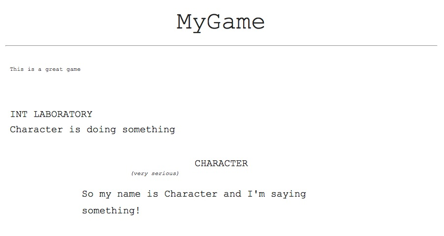

.. DialogC documentation master file, created by
   sphinx-quickstart on Fri Aug  7 08:35:09 2015.
   You can adapt this file completely to your liking, but it should at least
   contain the root `toctree` directive.

Welcome to DialogC
==================

DialogC is a Game Dialog Markup and Compilation tool. From a single YAML file dialog and other text elements are output into JSON and Script formats.

.. toctree::
   :maxdepth: 2

Markup Syntax
^^^^^^^^^^^^^

Document Attributes
-------------------

.. code-block:: yaml

	DOCUMENT:
	    title: MyGame
	    title_description: This is a great game
	    copyright: MyGameStudio

Story Blocks
------------

A `story block` a unique section of dialog, similar to a class. In fact, a story block becomes a class object within dialogc. Story blocks are handled differenly depending on the `story_block_type`, which can be one more of the follow, `static`, `dynamic`, `log`, `notes`, `spoken`.

A **static** story block is the simplest and can be used to create sequentially oriented dialog and other content. 

.. code-block:: yaml

	(StoryBlockName static):
		story_line:

			- incoming: The Game says something to the player
			  time_delay: 1
			  responses:
			  	- A response a Player can choose
			  	- A different response a Player can choose

			- incoming: The Game says something to the player a little bit later, in sequence
			  time_delay: 1
			  responses:
			  	- A response a Player can choose
			  	- A different response a Player can choose

A **dynamic** story block uses `event_keys`, to define a branching or more dynamic conversation keyed to an event in the game.

.. code-block:: yaml

	(DynamicConversationBlock dynamic):
	    keyed_storylines:

	        player_did_this:

	            response: Player says this
	            player_data_threshold: ">0"
	            time_delay_secs: 5
	            dynamic_storyline:
	                - time_delay_secs: 5
	                  incoming: A response to the player
	                  responses:
	                    - Player has this option with which to respone.
	                    - Or maybe the player wants to respond with this option instead.

	        then_the_player_did_this:

	            response: Player says this
	            player_data_threshold: ">0"
	            time_delay_secs: 5
	            dynamic_storyline:
	                - time_delay_secs: 5
	                  incoming: A response to the player
	                  responses:
	                    - Player has this option with which to respone.
	                    - Or maybe the player wants to respond with this option instead.

We can create a chunk of dialog that should be spoken and sent to a voice actor by adding the **spoken** story block type to the StoryBlock definitation. This will direct dialogc to also output HTML Script if the `-s` option is included on the command line.

.. code-block:: yaml

	(CharacterShouldSayThis static log spoken):
	    location: INT Laboratory
	    description: Character is doing something
	    entries:
	        - parenthetical: very serious
	          dialog: So my name is Character and I'm saying something!
        

Compilation and Output
^^^^^^^^^^^^^^^^^^^^^^

Running dialogc on the YAML file we create JSON and an HTML Script.

.. code-block:: bash
	
	python dialogc.py -d demo.yaml -o demo.json -v true -s demoscript.html

**JSON** Output

.. code-block:: python

	{'dynamic_storyline': [{'dynamic_storyline': [{'incoming': 'A response to the player',
	                                               'responses': ['Player has this option with which to respone.',
	                                                             'Or maybe the player wants to respond with this option instead.'],
	                                               'time_delay_secs': 5}],
	                        'player_data_threshold': '>0',
	                        'response': 'Player says this',
	                        'time_delay_secs': 5},
	                       {'dynamic_storyline': [{'incoming': 'A response to the player',
	                                               'responses': ['Player has this option with which to respone.',
	                                                             'Or maybe the player wants to respond with this option instead.'],
	                                               'time_delay_secs': 5}],
	                        'player_data_threshold': '>0',
	                        'response': 'Player says this',
	                        'time_delay_secs': 5}],
	 'story_block_name': [{'incoming': 'The Game says something to the player',
	                       'responses': ['A response a Player can choose',
	                                     'A different response a Player can choose'],
	                       'time_delay': 1},
	                      {'incoming': 'The Game says something to the player a little bit later, in sequence',
	                       'responses': ['A response a Player can choose',
	                                     'A different response a Player can choose'],
	                       'time_delay': 1}]}

**Script** Output

Indices and tables
==================

* :ref:`genindex`
* :ref:`modindex`
* :ref:`search`

